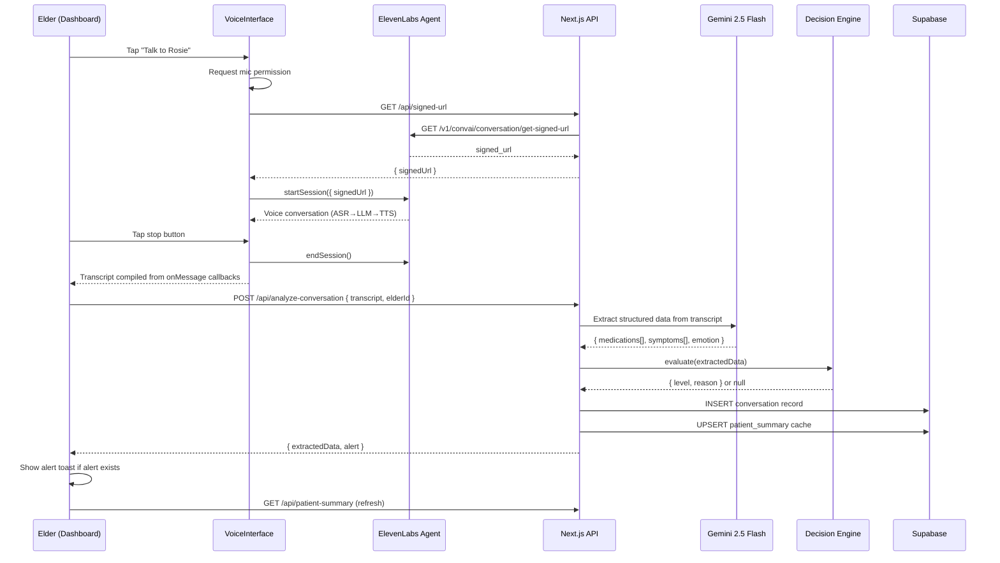
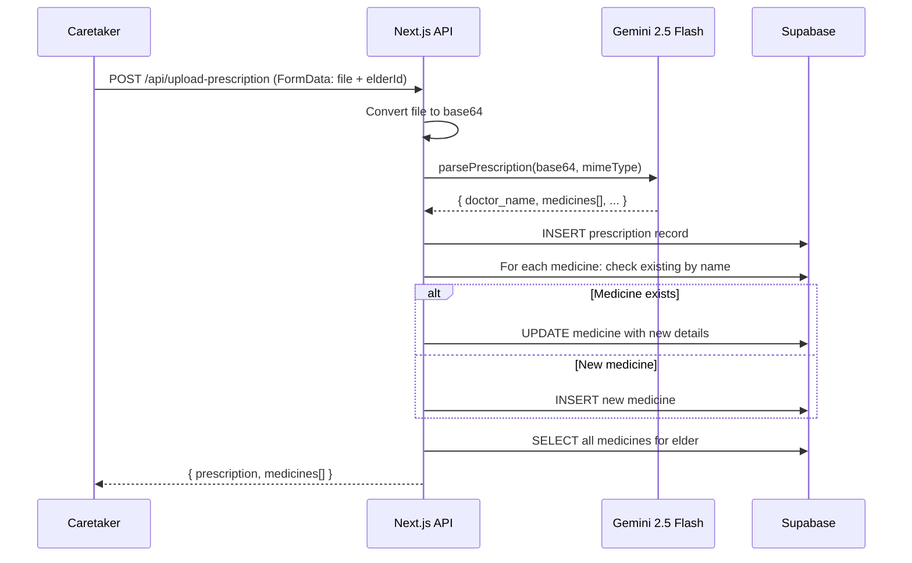

# Design Document — CareRing

## Overview

CareRing is a voice-first emotional care companion for elderly parents living alone. It uses ElevenLabs Conversational AI with a warm companion persona ("Rosie") and Google Gemini 2.5 Flash for intelligent data extraction from conversations and prescription documents.

The system is a **mobile-first Next.js 15 web app** rendered in a 430px viewport. Both elders and caretakers share one app with simple role selection on the landing page (no authentication). On desktop, the app displays inside a phone frame mockup with a description panel.

**Core data flow:**

```
Voice Check-In (ElevenLabs) → Transcript
  → Gemini 2.5 Flash extraction → ExtractedData (medications, symptoms, emotion)
  → Decision Engine (pure function) → Alert (level + reason)
  → Supabase persistence → Dashboard refresh (polling)
```

**Secondary flow (Prescription Upload):**

```
Prescription Image/PDF → Gemini 2.5 Flash Vision OCR
  → Structured prescription data + medicines
  → Supabase persistence → Dashboard update
```

### Key Design Decisions

| Decision | Rationale |
|----------|-----------|
| ElevenLabs Conversational AI | Handles full ASR→LLM→TTS loop; `useConversation` hook manages WebSocket, mic access, and turn-taking |
| Signed URL flow | Keeps ElevenLabs API key server-side; client fetches signed URL from `/api/signed-url` |
| Gemini 2.5 Flash (not OpenAI) | Used for both transcript extraction and prescription OCR; fast and cost-effective |
| Supabase with service role key | Single managed service for PostgreSQL; no RLS for hackathon simplicity |
| Decision engine as pure function | No DB calls, no side effects — takes ExtractedData in, returns alert or null. Maximizes testability |
| No authentication | Simple role selection landing page; hardcoded elder ID for demo |
| Flat conversation table with JSONB | Extracted data stored as JSONB in `conversations` table rather than normalized tables |
| Polling-based refresh | Dashboards poll every 30 seconds instead of Supabase realtime subscriptions |
| ConversationProvider at app root | ElevenLabs provider wraps entire app in `providers.tsx` |
| Phone frame mockup on desktop | CSS-based phone bezel with description panel for demo presentation |

## Architecture

### High-Level Architecture Diagram

```mermaid
graph TB
    subgraph "Browser (Mobile / Desktop)"
        A[App Shell<br/>layout.tsx] --> B[Elder Dashboard<br/>elder/page.tsx]
        A --> C[Caretaker Dashboard<br/>caretaker/page.tsx]
        A --> D[Landing Page<br/>page.tsx]
        B --> E[VoiceInterface<br/>useConversation hook]
        B --> F[MedicineTimeline]
        B --> G[MoodTracker]
        E -->|WebSocket| H[ElevenLabs<br/>Conversational AI]
    end

    subgraph "Next.js API Routes"
        I[/api/signed-url]
        J[/api/analyze-conversation]
        K[/api/medication-log]
        L[/api/medicine]
        M[/api/mood]
        N[/api/patient-summary]
        O[/api/alerts/acknowledge]
        P[/api/upload-prescription]
    end

    subgraph "External Services"
        H
        Q[Google Gemini 2.5 Flash]
        R[Supabase PostgreSQL]
    end

    E -->|transcript on session end| J
    J -->|extract| Q
    J -->|evaluate + persist| R
    K --> R
    L --> R
    M --> R
    N --> R
    O --> R
    P -->|OCR| Q
    P -->|persist| R
    I -->|get signed URL| H
    B -->|poll every 30s| N
    C -->|poll every 30s| N
```

### Request Flow: Voice Conversation Session



### Request Flow: Prescription Upload



### Component Architecture

The app follows a clear separation of concerns:

- **UI Layer** (`app/`, `components/`): Next.js pages and React components. Elder dashboard is voice-first with large touch targets. Caretaker dashboard is card-based with prescription management.
- **API Layer** (`app/api/`): Next.js Route Handlers. Thin orchestration — validate input, call lib functions, persist to Supabase.
- **Business Logic** (`lib/`): Pure, testable functions. The decision engine lives here with zero database dependencies. Gemini AI integration handles extraction and OCR.
- **Data Layer**: Supabase client (`@supabase/supabase-js`) with service role key for all server-side DB operations. No RLS policies.

## Components and Interfaces

### 1. VoiceInterface (`components/VoiceInterface.tsx`)

Custom hook wrapping the ElevenLabs `useConversation` hook. Exported as `useVoiceInterface`. Supports client tools and session overrides for contextual conversations.

```typescript
type VoiceStatus = "idle" | "micRequested" | "connecting" | "connected" | "disconnected";

interface SessionResult {
  transcript: string;
}

interface ClientToolsMap {
  [toolName: string]: (params: Record<string, unknown>) => Promise<string | Record<string, unknown>>;
}

interface SessionOverrides {
  systemPromptContext?: string;
  firstMessage?: string;
}

interface Props {
  onSessionEnd: (result: SessionResult) => void;
  onError: (err: Error) => void;
  clientTools?: ClientToolsMap;
  overrides?: SessionOverrides;
}

// Returns: { status: VoiceStatus, start: () => Promise<void>, stop: () => void }
function useVoiceInterface(props: Props): { status: VoiceStatus; start: () => Promise<void>; stop: () => void };
```

**Behavior:**
- Requests mic permission before starting
- Calls `/api/signed-url` to get a signed URL (keeps API key server-side)
- Starts session with `connectionType: "websocket"`
- Passes `clientTools` to `startSession` so the agent can call them mid-conversation
- Passes `overrides` with system prompt context and first message for personalization
- Collects transcript turns via `onMessage` callback (labels as "User" or "Companion")
- On disconnect, compiles full transcript and calls `onSessionEnd`
- Handles errors gracefully, returning to idle state

### 2. TalkButton (`components/elder/TalkButton.tsx`)

UI component that wraps `useVoiceInterface` with start/stop button and status labels. Passes through client tools and overrides.

```typescript
interface Props {
  onSessionEnd: (transcript: string) => void;
  clientTools?: ClientToolsMap;
  overrides?: SessionOverrides;
}
```

**Behavior:**
- Displays status-specific labels (idle, mic requested, connecting, connected, disconnected)
- Shows waveform animation when connected
- Shows pulse animation when connecting
- Large touch target button for start/stop

### 3. Gemini Extractor (`lib/gemini.ts`)

Server-side AI integration for transcript extraction and prescription OCR.

```typescript
interface ExtractedData {
  medications: { name: string; status: MedStatus }[];
  symptoms: { name: string; duration: string; severity: Severity }[];
  emotion: Emotion;
}

interface PrescriptionData {
  doctor_name: string;
  doctor_qualification?: string;
  clinic_name?: string;
  patient_name: string;
  patient_age?: number;
  prescription_date: string;
  follow_up_days?: number;
  follow_up_date?: string;
  doctor_advice?: string;
  medicines: {
    name: string;
    dosage: string;
    quantity: string;
    frequency: string;
    times: string[];
    instructions: string;
    with_food: boolean;
  }[];
}

function extractFromTranscript(transcript: string): Promise<ExtractedData>;
function parsePrescription(base64Data: string, mimeType: string): Promise<PrescriptionData>;
```

**Behavior:**
- Uses `gemini-2.5-flash` model for both functions
- Prompt engineering for structured JSON output (not JSON mode)
- Cleans markdown code fences from Gemini responses
- Returns safe fallback on any error (empty data, not null)

### 4. DecisionEngine (`lib/decisionEngine.ts`)

**Pure function** — no database calls, no side effects. Takes ExtractedData, returns alert or null.

```typescript
type AlertLevel = 'low' | 'medium' | 'high';

interface AlertResult {
  level: AlertLevel;
  reason: string;
}

function evaluate(data: ExtractedData): AlertResult | null;
```

**Rule evaluation logic (pure):**
1. **Medication rules:** any missed medication → level "medium", include missed med names in reason
2. **Symptom rules:** any high-severity symptom → level "high", include symptom name in reason
3. **Emotional wellness rules:** sad or anxious emotion → level "low", include emotion in reason
4. **Combination:** multiple triggers combine — highest level wins, all reasons joined with "; "
5. If no triggers → return null

**Helper:** `higher(a, b)` compares two AlertLevel values using ordered array `['low', 'medium', 'high']`.

### 5. MedicineTimeline (`components/elder/MedicineTimeline.tsx`)

Elder-facing medicine schedule with manual status logging.

```typescript
interface Props {
  elderId: string;
  medicines: Medicine[];
  medicationLogs: MedicationLog[];
  statusData?: { name: string; status: "taken" | "missed" | "unknown" }[];
  onStatusChange?: () => void;
}
```

**Behavior:**
- Builds timeline entries sorted by scheduled time
- Status priority: manual log > voice-reported > time-based inference
- Time-based inference: past due + 30min → missed, within 10min window → due, else upcoming
- "Took it" / "Missed" buttons for each medicine (one entry per medicine per day)
- Browser TTS reminder for missed medicines (via `speechSynthesis`)
- Visual timeline with colored indicators per status

### 6. MoodTracker (`components/elder/MoodTracker.tsx`)

Emoji-based mood selection with API persistence.

```typescript
interface Props {
  elderId: string;
  onMoodSaved?: () => void;
  currentMood?: Emotion | null;
}
```

**Behavior:**
- Five mood options: happy, good, neutral, sad, anxious
- Saves mood via POST `/api/mood` (creates a conversation record)
- Visual highlight on selected mood

### 7. API Routes

| Route | Method | Purpose |
|-------|--------|---------|
| `/api/signed-url` | GET | Returns ElevenLabs signed URL for WebSocket connection (edge runtime) |
| `/api/analyze-conversation` | POST | Transcript → Gemini extraction → decision engine → save conversation + update patient_summary |
| `/api/medication-log` | GET | Get today's medication logs for an elder |
| `/api/medication-log` | POST | Log a medicine as taken/missed (one per medicine per day) |
| `/api/medicine` | POST | Add a new medicine |
| `/api/medicine/[id]` | PUT | Update an existing medicine |
| `/api/medicine/[id]` | DELETE | Delete a medicine |
| `/api/mood` | POST | Save a manual mood entry as a conversation record |
| `/api/patient-summary` | GET | Aggregated patient data: elder name, prescription, medicines, conversations, symptoms, mood, alerts, medication logs |
| `/api/alerts/acknowledge` | POST | Mark a conversation's alert as acknowledged |
| `/api/upload-prescription` | POST | Upload prescription file → Gemini OCR → save prescription + upsert medicines |

### 8. App Shell (`app/layout.tsx`)

```typescript
// Layout structure:
// 1. HTML with Google Fonts (DM Serif Display + Nunito)
// 2. ConversationProvider (ElevenLabs) wraps everything
// 3. Desktop: description panel + phone frame wrapper
// 4. Phone frame contains the actual app content
// 5. Mobile: just the app content (no frame)
```

**Mobile viewport:** Exported `viewport` config sets `width=device-width, initialScale=1, maximumScale=1, viewportFit=cover`. Content wrapped in phone frame CSS on desktop.

### 9. Landing Page (`app/page.tsx`)

Simple role selection with two large buttons:
- "I need care" → navigates to `/elder`
- "I give care" → navigates to `/caretaker`

No authentication — direct navigation based on role selection.

### 10. ElderContext Builder (`lib/elderContext.ts`)

Pure function that builds a context object for Rosie's session from the elder's PatientSummary.

```typescript
interface ElderContext {
  elderName: string;
  currentTime: string;
  greeting: string;
  medicinesSummary: string;
  dueMedicines: string;
  recentSymptomsSummary: string;
  lastMood: string;
  lastCheckIn: string;
  systemPromptContext: string;
  firstMessage: string;
}

function buildElderContext(summary: PatientSummary): ElderContext;
```

**Behavior:**
- Extracts elder's first name from summary
- Computes medicine statuses (taken/missed/due/upcoming) based on medication logs and current time
- Formats recent symptoms and mood for prompt injection
- Generates a `systemPromptContext` block with all elder data for the agent's system prompt override
- Generates a personalized `firstMessage` that greets by name and asks about due/missed medicines
- Used by the Elder Dashboard to build `SessionOverrides` before starting a voice session

### 11. ElevenLabs Agent Client Tools

Four client tools registered with the ElevenLabs agent at session start:

| Tool | Purpose | Parameters | Returns |
|------|---------|------------|---------|
| `getMedicationSchedule` | Fetch today's medicines with real-time status | None | JSON: medicines array with name, dosage, frequency, times, status |
| `getRecentSymptoms` | Fetch last 5 symptoms from conversations | None | JSON: symptoms array with name, severity, duration |
| `getEmotionalHistory` | Fetch latest mood | None | JSON: latestMood, latestMoodTime |
| `logMedicationStatus` | Record medicine as taken/missed | `medicine_name` (string), `status` (string: "taken"/"missed") | JSON: success confirmation |

All tools are configured as ElevenLabs client tools with `expects_response: true` and `execution_mode: "immediate"`. The `logMedicationStatus` tool has `disable_interruptions: true` to prevent partial writes.

## Data Models

### Supabase Database Schema

```mermaid
erDiagram
    users ||--o{ assignments : "participates in"
    users ||--o{ prescriptions : "has"
    users ||--o{ medicines : "has"
    users ||--o{ conversations : "has"
    users ||--o| patient_summary : "has"
    users ||--o{ medication_logs : "has"
    prescriptions ||--o{ medicines : "linked to"

    users {
        uuid id PK
        text name
        text role "elder | caretaker"
        timestamptz created_at
    }

    assignments {
        uuid id PK
        uuid elder_id FK
        uuid caretaker_id FK
    }

    prescriptions {
        uuid id PK
        uuid elder_id FK
        text doctor_name
        text doctor_qualification
        text clinic_name
        text patient_name
        int patient_age
        date prescription_date
        date follow_up_date
        text doctor_advice
        timestamptz created_at
    }

    medicines {
        uuid id PK
        uuid elder_id FK
        uuid prescription_id FK
        text name
        text dosage
        text quantity "default: 1 tablet"
        text frequency
        text_array times "HH:mm array"
        text instructions
        boolean with_food "default: false"
        timestamptz created_at
    }

    conversations {
        uuid id PK
        uuid elder_id FK
        text transcript
        jsonb extracted "ExtractedData"
        text emotion
        text alert_level "low | medium | high | null"
        text alert_reason
        boolean acknowledged "default: false"
        timestamptz created_at
    }

    medication_logs {
        uuid id PK
        uuid elder_id FK
        uuid medicine_id FK
        text medicine_name
        text status "taken | missed"
        timestamptz created_at
    }

    patient_summary {
        uuid elder_id PK_FK
        text last_emotion
        text last_alert
        timestamptz last_updated
        jsonb recent_symptoms
        text last_med_status
    }
```

### TypeScript Type Definitions (`lib/types.ts`)

```typescript
export type AlertLevel = 'low' | 'medium' | 'high';
export type MedStatus = 'taken' | 'missed' | 'unknown';
export type Severity = 'low' | 'medium' | 'high';
export type Emotion = 'happy' | 'good' | 'sad' | 'anxious' | 'neutral';

export interface Prescription {
  id: string;
  elder_id: string;
  doctor_name: string;
  doctor_qualification?: string;
  clinic_name?: string;
  patient_name: string;
  patient_age?: number;
  prescription_date: string;
  follow_up_date?: string;
  doctor_advice?: string;
  created_at: string;
}

export interface Medicine {
  id: string;
  elder_id: string;
  prescription_id?: string;
  name: string;
  dosage: string;
  quantity: string;
  frequency: string;
  times: string[];
  instructions: string;
  with_food: boolean;
  created_at: string;
}

export interface Conversation {
  id: string;
  elder_id: string;
  transcript: string;
  extracted: ExtractedData | null;
  emotion: string;
  alert_level: string | null;
  alert_reason: string | null;
  acknowledged: boolean;
  created_at: string;
}

export interface MedicationLog {
  id: string;
  conversation_id: string;
  medicine_name: string;
  status: MedStatus;
  created_at: string;
}

export interface Symptom {
  id: string;
  conversation_id: string;
  name: string;
  duration: string | null;
  severity: Severity;
  created_at: string;
}

export interface MoodLog {
  id: string;
  conversation_id: string;
  emotion: Emotion;
  created_at: string;
}

export interface Alert {
  id: string;
  conversation_id: string | null;
  level: AlertLevel;
  reason: string;
  acknowledged: boolean;
  created_at: string;
}

export interface ExtractedData {
  medications: { name: string; status: MedStatus }[];
  symptoms: { name: string; duration: string; severity: Severity }[];
  emotion: Emotion;
}

export interface PatientSummary {
  elderName: string | null;
  prescription: Prescription | null;
  medicines: Medicine[];
  latestConversation: Conversation | null;
  medicationLogs: MedicationLog[];
  recentSymptoms: Symptom[];
  latestMood: MoodLog | null;
  unacknowledgedAlerts: Alert[];
  allAlerts: Alert[];
}
```

## Correctness Properties

The following properties target the pure business logic in `lib/decisionEngine.ts` — the only component where property-based testing with `fast-check` provides clear value in the current implementation.

### Property 1: Decision engine medication alert severity

*For any* ExtractedData where at least one medication has `status === 'missed'`, the decision engine SHALL produce an alert with `level` at least `'medium'`.

**Validates: Requirements 3.2**

### Property 2: Decision engine symptom alert severity

*For any* ExtractedData where at least one symptom has `severity === 'high'`, the decision engine SHALL produce an alert with `level === 'high'`.

**Validates: Requirements 3.3**

### Property 3: Decision engine no-trigger returns null

*For any* ExtractedData where no medications are missed, no symptoms have high severity, and emotion is not sad or anxious, the decision engine SHALL return null.

**Validates: Requirements 3.6**

### Property 4: Decision engine structural invariants

*For any* input to the decision engine, if an alert is returned it SHALL have:
- A `level` that is one of: 'low', 'medium', 'high'
- A non-empty `reason` string

**Validates: Requirements 3.7**

### Property 5: Decision engine severity ordering

*For any* ExtractedData, the returned alert level SHALL be the maximum of all individual trigger levels. The ordering is: low < medium < high.

**Validates: Requirements 3.5**

### Property 6: Gemini extraction fallback safety

*For any* failed extraction, `extractFromTranscript` SHALL return `{ medications: [], symptoms: [], emotion: 'neutral' }` — never null, never undefined, never throwing.

**Validates: Requirements 2.6**
