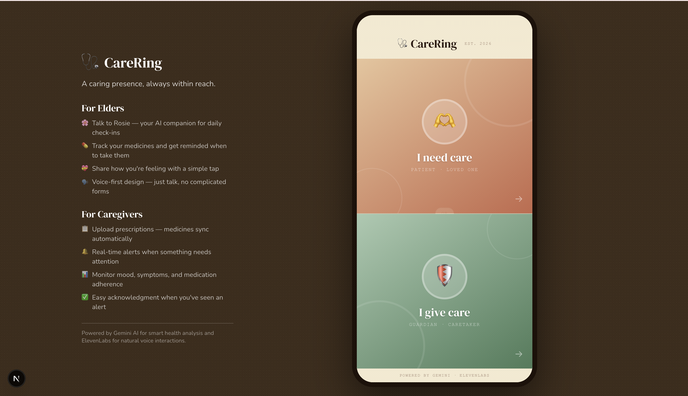
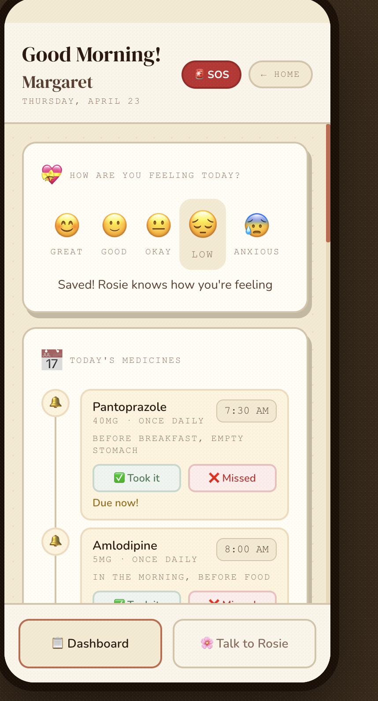
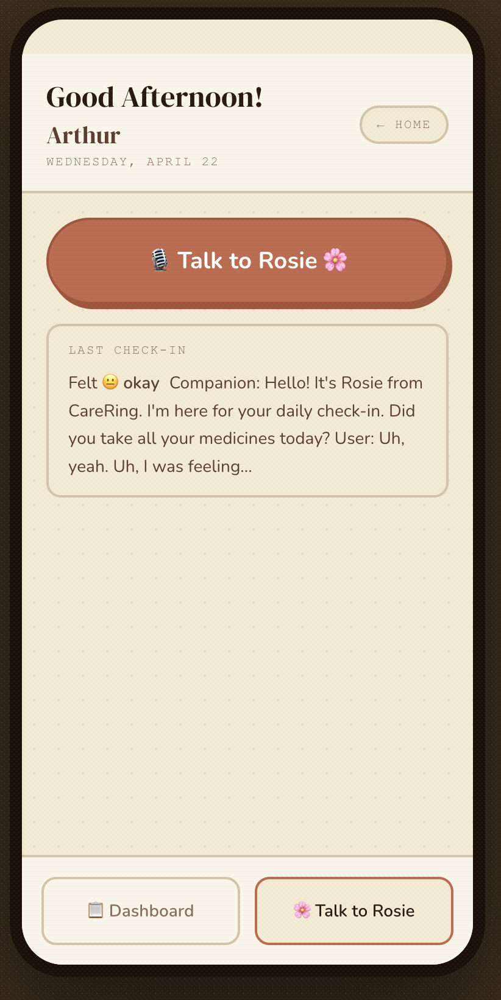
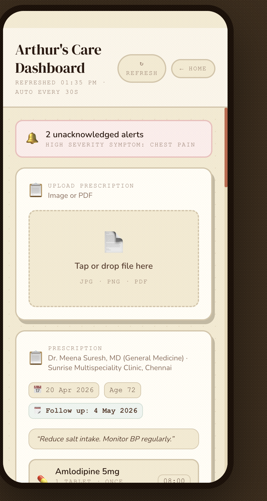
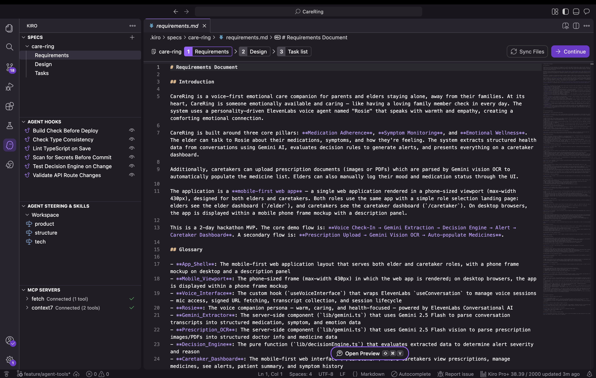

# 🩺 CareRing

**A caring presence, always within reach.**

CareRing is a voice-first care companion for elderly parents living alone. Rosie — powered by **ElevenLabs Conversational AI** — checks in daily, asks about medications by name, follows up on symptoms, and logs everything automatically. Caretakers get real-time alerts and a full health dashboard, even from across the world.

> *When you live thousands of miles from your parents, in a different timezone, the hardest part isn't the distance — it's not knowing. Did they take their medicine? Are they in pain? Are they just saying they're fine? CareRing was built so that no caretaker has to wonder.*

<p align="center">
  
</p>

---

## ✨ What it does

### For Elders
- 🌸 **Talk to Rosie** — natural voice check-ins via ElevenLabs Conversational AI
- 🧠 **Context-aware** — Rosie knows your medicines, symptoms, and mood before you say a word
- 💊 **Voice medication logging** — "I took my Amlodipine" → logged automatically via client tools
- 🔊 **ElevenLabs TTS reminders** — missed medicine reminders in a warm voice (or your family's cloned voice)
- 💝 **One-tap mood tracking** — emoji-based, no typing needed
- 🚨 **SOS Emergency** — one-tap emergency call + instant caretaker alert

<p align="center">
  
  &nbsp;&nbsp;
  
</p>

### For Caretakers
- 📄 **Prescription OCR** — upload a photo → Gemini Vision extracts medicines automatically
- 🎙️ **Voice cloning** — clone your voice so medicine reminders sound like you, not a robot
- 🔔 **Real-time alerts** — missed meds, high-severity symptoms, emotional distress, SOS triggers
- 📊 **Patient summary** — medicines, mood, symptoms, alerts at a glance
- 🌡️ **Symptom history** — track patterns with severity indicators

<p align="center">
  
</p>

---

## 🏗️ How it works

```
Elder Context (medicines, symptoms, mood) → Session Override
  → ElevenLabs Voice Agent (Rosie) ← Client Tools
  → Transcript → Gemini 2.5 Flash → Structured Data
  → Decision Engine (pure function) → Alerts → Caretaker Dashboard
```

### ElevenLabs Integration

Rosie isn't just a chatbot — she's equipped with **4 client tools** that give her real-time access to the elder's health data:

| Tool | What Rosie can do |
|------|-------------------|
| `getMedicationSchedule` | Check which medicines are due, taken, or missed right now |
| `getRecentSymptoms` | Ask follow-ups: "Last time you mentioned a headache — how is that today?" |
| `getEmotionalHistory` | Adapt tone based on recent mood |
| `logMedicationStatus` | Log taken/missed when the elder confirms — dashboard updates instantly |

At session start, the elder's full context is injected via **system prompt and first message overrides** — Rosie greets by name and asks about specific due medicines from the first word.

### Voice Cloning & TTS Reminders

Caretakers can **clone their voice** using ElevenLabs Instant Voice Cloning — upload a 30-second audio sample, and all medicine reminders will sound like them instead of a default AI voice. The elder hears their daughter or son reminding them to take their medicine, even from thousands of miles away.

Medicine reminders use **ElevenLabs TTS** (`eleven_flash_v2_5` model) with automatic fallback to browser speech synthesis if the API is unavailable.

### SOS Emergency

A persistent red SOS button on the elder dashboard. One tap → confirmation → opens the phone dialer with the emergency number AND fires a critical alert to the caretaker instantly. The elder gets help, the caretaker knows immediately.

### Tech Stack

| Layer | Technology |
|-------|-----------|
| Frontend | Next.js 15 (App Router) + Tailwind CSS v4 |
| Backend | Next.js API Routes (9 endpoints) |
| Database | Supabase (PostgreSQL) |
| Voice AI | **ElevenLabs** Conversational AI + Client Tools + TTS + Voice Cloning |
| Extraction | Google Gemini 2.5 Flash |
| OCR | Google Gemini 2.5 Flash (Vision) |
| Testing | Vitest + fast-check (property-based testing) |

---

## 📱 Demo Flow

1. **Caretaker** uploads a prescription photo → Gemini OCR extracts medicines automatically
2. **Caretaker** clones their voice → medicine reminders now sound like them
3. **Elder** taps "Talk to Rosie" → Rosie greets by name, asks about specific due medicines
4. Elder says "I took my blood pressure pill" → Rosie calls `logMedicationStatus` → dashboard updates
5. Elder mentions knee pain → Gemini extracts symptom → decision engine fires alert
6. Missed medicine → ElevenLabs TTS reminder plays in the caretaker's cloned voice
7. **Caretaker** sees alerts instantly, acknowledges them
8. **Elder** taps SOS → phone dialer opens + caretaker gets critical alert

---

## 🚀 Getting Started

```bash
git clone https://github.com/sharmilaraghu/CareRing.git
cd CareRing
npm install
cp .env.local.example .env.local  # Fill in your keys
npm run dev
```

**Required env vars:** `NEXT_PUBLIC_SUPABASE_URL`, `NEXT_PUBLIC_SUPABASE_ANON_KEY`, `SUPABASE_SERVICE_ROLE_KEY`, `ELEVENLABS_API_KEY`, `NEXT_PUBLIC_ELEVENLABS_AGENT_ID`, `GEMINI_API_KEY`

**Database:** Run `supabase/migrations/003_final_schema.sql` and `004_medication_logs.sql` in your Supabase SQL editor.

---

## 🛠️ Built with Kiro + ElevenLabs

CareRing was built for the **ElevenLabs x Kiro Hackathon**. The project was deliberately chosen to be backend-heavy — multiple AI integrations, a pure decision engine, 11 API routes, client tool orchestration, voice cloning, TTS reminders — because that's where Kiro's systematic approach and ElevenLabs' voice platform make the biggest difference together.

<p align="center">
  
</p>

CareRing used **both modes of Kiro** — spec-driven development for the core architecture and business logic, and vibe coding for rapid UI iteration and feature exploration. The spec-driven workflow defined requirements, design, and correctness properties upfront. Vibe coding then accelerated the frontend — building components, styling, and wiring up integrations through fast conversational iteration. When vibe coding diverged from the original plan (switching AI providers, adding prescription OCR, adding client tools, adding voice cloning), the specs and steering files were updated to stay in sync. The result: structured where it matters, fast where it counts.

### Kiro Features Used

**Specs** — 14 requirements with formal acceptance criteria, a technical design with architecture diagrams and TypeScript interfaces, and 10 task groups — all tracked in `.kiro/specs/care-ring/`

**Steering Files** — three living documents (product, structure, tech stack) in `.kiro/steering/` kept the codebase aligned as the implementation evolved

**Correctness Properties** — formal properties for the decision engine became executable property-based tests with fast-check

**Kiro Hooks** — automated guardrails:

| Hook | Trigger | Purpose |
|------|---------|---------|
| Secret Scanner | Before git commit | Blocks commits containing API keys, tokens, or .env values |
| Lint on Save | TypeScript file saved | Catches ESLint errors before they reach the build |
| Test Decision Engine | `decisionEngine.ts` changed | Runs PBT to verify correctness properties still hold |
| Validate API Routes | API route file changed | Checks input validation, error handling, no hardcoded secrets |
| Type Consistency | `lib/types.ts` changed | Runs `tsc --noEmit` to catch type mismatches across the codebase |
| Build Before Deploy | Vercel deploy command | Runs production build locally before deploying |

**MCP Servers** — extended Kiro's capabilities:

| Server | What it provided |
|--------|-----------------|
| **Context7** | Up-to-date docs for Next.js, Supabase, ElevenLabs SDK, Tailwind CSS, fast-check |
| **Fetch** | Real-time web access for ElevenLabs agent tool schemas, Gemini API docs |

**Kiro Powers** — [ElevenLabs Power](https://kiro.dev) provided direct access to ElevenLabs documentation and API references within the development context, enabling rapid integration of Conversational AI, client tools, TTS, and Instant Voice Cloning without context-switching to external docs.

### ElevenLabs Features Used

| Feature | How CareRing uses it |
|---------|---------------------|
| **Conversational AI** | Rosie — the voice companion that conducts daily health check-ins with elders |
| **Client Tools** | 4 tools (getMedicationSchedule, getRecentSymptoms, getEmotionalHistory, logMedicationStatus) give Rosie real-time access to health data |
| **Session Overrides** | Elder's medicines, symptoms, and mood injected at session start for personalized conversations |
| **Text-to-Speech** | `eleven_flash_v2_5` model powers medicine reminders with warm, natural voice |
| **Instant Voice Cloning** | Caretakers clone their voice so reminders sound like a loved one, not a robot |

---

## 📄 License

MIT — see [LICENSE](LICENSE)

---

<p align="center">
  <strong>CareRing</strong> · Built for the ElevenLabs x Kiro Hackathon<br/>
  ElevenLabs (Conversational AI + TTS + Voice Cloning) · Kiro (Specs + Hooks + MCP) · Gemini · Supabase<br/>
  <em>Because the greatest act of love is simply being present.</em>
</p>
