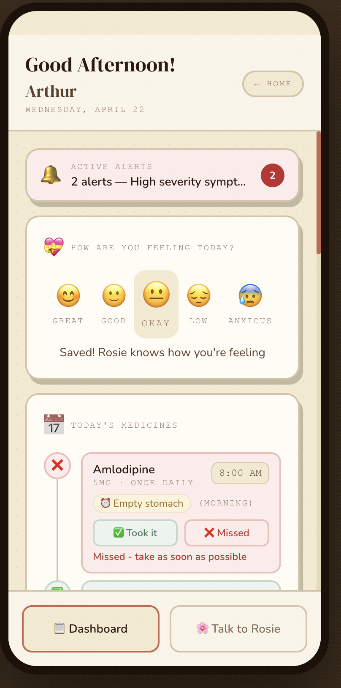

# 🩺 CareRing

**A caring presence, always within reach.**

CareRing is a voice-first emotional care companion for elderly parents living alone. It uses ElevenLabs Conversational AI with a warm companion persona ("Rosie") and Google Gemini AI for intelligent health data extraction — turning natural voice conversations into actionable health insights for caretakers.

<!-- Screenshot: Landing page with role selection -->


---

## ✨ Features

### For Elders
- 🌸 **Talk to Rosie** — Voice-first health check-ins powered by ElevenLabs Conversational AI
- 🧠 **Context-Aware Conversations** — Rosie knows your medicines, symptoms, and mood before you say a word
- 💊 **Voice Medication Logging** — Tell Rosie you took your medicine and it's logged automatically via client tools
- 💊 **Medicine Timeline** — Visual daily schedule with one-tap taken/missed logging
- 💝 **Mood Tracker** — Quick emoji-based mood check-ins
- 📋 **Doctor Guidelines** — Prescription advice and follow-up reminders
- 🔔 **Smart Alerts** — Severity-based notifications from conversation analysis

<!-- Screenshot: Elder dashboard showing medicine timeline and mood tracker -->


<!-- Screenshot: Voice conversation with Rosie active -->


### For Caretakers
- 📄 **Prescription Upload** — Upload prescription images/PDFs → Gemini Vision OCR auto-populates medicines
- 💊 **Medicine Management** — Add, edit, and remove medicines with full schedule details
- 🔔 **Real-time Alerts** — Severity-coded alerts (high/medium/low) with acknowledge workflow
- 🌡️ **Symptom History** — Track reported symptoms with severity trends
- 📊 **Patient Summary** — At-a-glance cards for medicines, mood, symptoms, and alerts

<!-- Screenshot: Caretaker dashboard with prescription card and alerts -->


---

## 🏗️ Architecture

```
Elder Context (medicines, symptoms, mood) → Session Override
  → ElevenLabs Voice Agent (Rosie) ← Client Tools (getMedicationSchedule, logMedicationStatus, ...)
  → Transcript → Gemini 2.5 Flash Extraction → Structured Data
  → Decision Engine (pure function) → Alerts
  → Supabase Persistence → Dashboard Refresh

Prescription Upload → Gemini Vision OCR → Medicines Auto-populated
```

### Tech Stack

| Layer | Technology |
|-------|-----------|
| **Frontend** | Next.js 15 (App Router) + Tailwind CSS v4 |
| **Backend** | Next.js API Routes |
| **Database** | Supabase (PostgreSQL) |
| **Voice AI** | ElevenLabs Conversational AI + Client Tools |
| **Data Extraction** | Google Gemini 2.5 Flash |
| **Prescription OCR** | Google Gemini 2.5 Flash (Vision) |
| **Testing** | Vitest + fast-check (property-based testing) |

### ElevenLabs Client Tools

Rosie is enhanced with 4 client tools that execute in the browser and give her real-time access to the elder's health data:

| Tool | What it does |
|------|-------------|
| `getMedicationSchedule` | Fetches today's medicines with live taken/missed/due status |
| `getRecentSymptoms` | Retrieves symptoms from past conversations for follow-up |
| `getEmotionalHistory` | Gets the elder's latest mood for empathetic responses |
| `logMedicationStatus` | Records taken/missed status when the elder confirms via voice |

At session start, the elder's full context (medicines, symptoms, mood, name) is injected via system prompt and first message overrides — so Rosie greets by name and asks about specific due medicines from the first word.

### Key Design Decisions

- **Decision engine is a pure function** — no DB calls, no side effects, fully testable with property-based testing
- **Gemini handles both extraction and OCR** — single AI provider for transcript parsing and prescription reading
- **Flat conversation table with JSONB** — extracted data stored alongside transcripts for simplicity
- **Mobile-first with phone frame** — 430px viewport with desktop phone mockup for demo presentation
- **No authentication** — simple role selection for hackathon demo speed

---

## 📁 Project Structure

```
app/
├── page.tsx                    # Landing — role selection
├── elder/page.tsx              # Elder dashboard (voice + medicines + mood)
├── caretaker/page.tsx          # Caretaker dashboard (prescriptions + alerts)
└── api/
    ├── signed-url/             # ElevenLabs signed URL
    ├── analyze-conversation/   # Transcript → extraction → alerts
    ├── upload-prescription/    # Prescription OCR
    ├── medicine/               # Medicine CRUD
    ├── medication-log/         # Daily taken/missed logging
    ├── mood/                   # Manual mood entry
    ├── patient-summary/        # Aggregated patient data
    └── alerts/acknowledge/     # Alert acknowledgment

components/
├── VoiceInterface.tsx          # ElevenLabs useConversation hook
├── elder/                      # Elder UI components
└── caretaker/                  # Caretaker UI components

lib/
├── types.ts                    # Domain types
├── decisionEngine.ts           # Alert evaluation (pure function)
├── elderContext.ts              # Elder context builder for voice sessions
├── gemini.ts                   # Gemini AI extraction + OCR
└── supabase/                   # Database clients
```

---

## 🚀 Getting Started

### Prerequisites

- Node.js 18+
- A [Supabase](https://supabase.com) project
- An [ElevenLabs](https://elevenlabs.io) account with a Conversational AI agent
- A [Google AI Studio](https://aistudio.google.com) API key (Gemini)

### Setup

1. **Clone the repo**
   ```bash
   git clone https://github.com/sharmilaraghu/CareRing.git
   cd CareRing
   ```

2. **Install dependencies**
   ```bash
   npm install
   ```

3. **Set up environment variables**

   Copy the example and fill in your keys:
   ```bash
   cp .env.local.example .env.local
   ```

   Required variables:
   ```
   NEXT_PUBLIC_SUPABASE_URL=your_supabase_url
   NEXT_PUBLIC_SUPABASE_ANON_KEY=your_anon_key
   SUPABASE_SERVICE_ROLE_KEY=your_service_role_key
   ELEVENLABS_API_KEY=your_elevenlabs_key
   NEXT_PUBLIC_ELEVENLABS_AGENT_ID=your_agent_id
   GEMINI_API_KEY=your_gemini_key
   ```

4. **Set up the database**

   Run the SQL migrations in your Supabase SQL editor:
   - `supabase/migrations/003_final_schema.sql`
   - `supabase/migrations/004_medication_logs.sql`

   Then seed demo data:
   - `supabase/seed.sql`

5. **Start the dev server**
   ```bash
   npm run dev
   ```

   Open [http://localhost:3000](http://localhost:3000)

---

## 🧪 Testing

```bash
# Run all tests (single run)
npm run test

# Watch mode
npm run test:watch
```

Tests use **Vitest** with **fast-check** for property-based testing of the decision engine.

---

## 📱 Demo Flow

1. **Landing page** → Select "I need care" (elder) or "I give care" (caretaker)

2. **As Caretaker:**
   - Upload a prescription image/PDF → medicines auto-populate via Gemini OCR
   - View patient summary, manage medicines, monitor alerts

3. **As Elder:**
   - Tap "Talk to Rosie" → Rosie greets you by name and asks about your specific due medicines
   - Rosie uses client tools to check your medication schedule, recent symptoms, and mood in real time
   - Tell Rosie "I took my Amlodipine" → she logs it automatically via `logMedicationStatus` → dashboard updates
   - Log mood with emoji taps
   - Mark medicines as taken/missed on the timeline
   - View doctor guidelines and follow-up dates

4. **After a voice check-in:**
   - Gemini extracts medications, symptoms, and emotion from the transcript
   - Decision engine evaluates and generates alerts if needed
   - Caretaker dashboard updates with new data and alerts

---

## 🗄️ Database Schema

| Table | Purpose |
|-------|---------|
| `users` | Elder and caretaker profiles |
| `assignments` | Elder ↔ caretaker relationships |
| `prescriptions` | Uploaded prescription metadata |
| `medicines` | Individual medications with schedule |
| `conversations` | Voice check-in transcripts + extracted data |
| `medication_logs` | Daily taken/missed tracking |
| `patient_summary` | Cached summary for fast dashboard reads |

---

## 🛠️ Built with Kiro

CareRing was built for a hackathon sponsored by [Kiro](https://kiro.dev) — and it was deliberately chosen as a project that plays to Kiro's strengths. Most AI coding tools handle simple UI tasks fine, but CareRing is backend-heavy: multiple API routes, AI integrations, a pure decision engine with formal correctness properties, database schema design, ElevenLabs client tool integration, and two distinct dashboards. This is where Kiro's systematic, spec-driven approach makes a real difference.

### How Kiro was used

Kiro guided the entire development lifecycle:

1. **Spec-Driven Development** — Kiro's requirements → design → tasks workflow formalized 14 requirements with precise acceptance criteria before any code was written. Each requirement has clear WHEN/THEN criteria, not vague descriptions. The design document includes architecture diagrams, TypeScript interfaces, API specs, database schema, and data flow sequences.

2. **Correctness Properties & Property-Based Testing** — Kiro helped define formal correctness properties for the decision engine before implementation. Properties like "if any medication has status missed, the alert level must be at least medium" became executable tests with fast-check, providing confidence across all valid inputs — not just a handful of examples.

3. **Steering Files** — Three steering documents (product overview, project structure, tech stack) kept all work aligned as the implementation evolved. When the stack changed (OpenAI → Gemini, simplified schema, added prescription OCR, added client tools), the steering files were updated to reflect reality.

4. **Hooks** — Kiro hooks were configured to enforce development practices:
   - **Pre-commit secret scanning** — a hook checks staged changes for API keys, tokens, and credentials before every commit, preventing accidental secret exposure
   - **Post-tool-use validation** — hooks verify that write operations follow project conventions

5. **MCP Integration** — The project uses MCP (Model Context Protocol) servers for enhanced development capabilities:
   - **Context7** — provides up-to-date documentation for libraries (Next.js, Supabase, ElevenLabs, fast-check) directly in the development context, ensuring code follows current API patterns rather than outdated training data
   - **Fetch** — enables real-time web access for checking latest ElevenLabs agent tool schemas, Gemini API docs, and Supabase migration patterns

### The systematic advantage

The spec-driven approach meant that even when rapid hackathon iteration changed the implementation significantly — adding ElevenLabs client tools, switching AI providers, adding prescription OCR — there was always a clear record of what was built, why, and how it maps to requirements. The decision engine has formal correctness guarantees backed by property-based tests. The 14 requirements, 6 correctness properties, and 10 task groups stayed in sync with the code throughout.

For a hackathon project with this much backend complexity, Kiro's structured workflow prevented the architectural drift that typically happens when you're moving fast under time pressure.

---

## 🌐 Deployment

Deployed on **Vercel** with automatic deployments on push to `main`.

[](https://vercel.com/new/clone?repository-url=https://github.com/sharmilaraghu/CareRing)

---

## 📄 License

This project is licensed under the MIT License — see the [LICENSE](LICENSE) file for details.

---

<p align="center">
  <em>Built with ❤️ for elders who deserve a caring presence, always within reach.</em>
</p>
